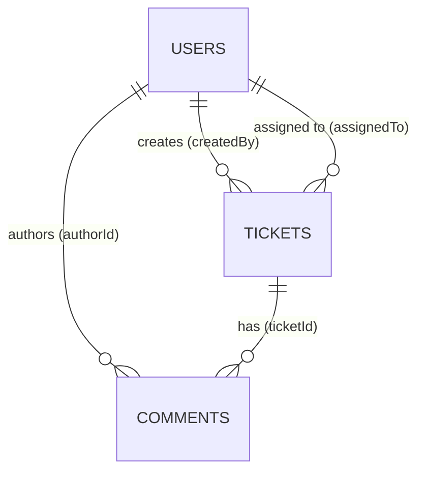

# Support Ticket Management System — Database Design

## 1. Overview

This document defines the MongoDB database structure for an internal **Support Ticket Management System**. The design supports employees creating tickets, assigning them to other internal users, tracking lifecycle changes, and maintaining comment history.

**Database:** MongoDB  
**Collections:** `users`, `tickets`, `comments`  
**Design approach:** Document-oriented with explicit foreign-key references (`ObjectId`) and application-level referential integrity.

---

## 2. Entities

### 2.1 User

Represents an internal employee who can authenticate, create tickets, be assigned tickets, and post comments.

| Field | Type | Required | Description |
|---|---|---|---|
| `_id` | ObjectId | Yes | Primary key |
| `name` | string | Yes | Full display name (1–100 chars) |
| `email` | string | Yes | Unique login identifier (lowercase, validated) |
| `passwordHash` | string | Yes | Hashed password (never store plaintext) |
| `role` | UserRole enum | Yes | Access level within the system |
| `department` | string | No | Organizational unit (e.g. IT, HR, Finance) |
| `isActive` | boolean | Yes | Soft-disable without deleting history |
| `createdAt` | Date | Yes | Record creation timestamp |
| `updatedAt` | Date | Yes | Last modification timestamp |

**Why:** Users are the actors in every workflow. Separating `role` and `isActive` allows authorization rules and account deactivation without data loss.

---

### 2.2 Ticket

Represents a support request submitted by an employee.

| Field | Type | Required | Description |
|---|---|---|---|
| `_id` | ObjectId | Yes | Primary key |
| `title` | string | Yes | Short summary (1–200 chars) |
| `description` | string | Yes | Full problem description (1–5000 chars) |
| `status` | TicketStatus enum | Yes | Current lifecycle state |
| `priority` | TicketPriority enum | Yes | Urgency level |
| `category` | string | No | Ticket classification (e.g. Hardware, Software) |
| `createdBy` | ObjectId → User | Yes | Employee who opened the ticket |
| `assignedTo` | ObjectId → User | No | Internal user responsible for resolution |
| `resolvedAt` | Date | Conditional | Required when status is `resolved` or `closed` |
| `closedAt` | Date | Conditional | Required when status is `closed` |
| `cancelledAt` | Date | Conditional | Required when status is `cancelled` |
| `createdAt` | Date | Yes | Record creation timestamp |
| `updatedAt` | Date | Yes | Last modification timestamp |

**Why:** Tickets are the core business entity. `createdBy` is always required because every ticket must have an owner. `assignedTo` is optional because tickets start unassigned. Lifecycle timestamps (`resolvedAt`, `closedAt`, `cancelledAt`) support SLA reporting and audit trails.

---

### 2.3 Comment

Represents a message in a ticket's discussion thread.

| Field | Type | Required | Description |
|---|---|---|---|
| `_id` | ObjectId | Yes | Primary key |
| `ticketId` | ObjectId → Ticket | Yes | Parent ticket |
| `authorId` | ObjectId → User | Yes | Employee who wrote the comment |
| `content` | string | Yes | Comment body (1–5000 chars) |
| `isInternal` | boolean | Yes | `true` = visible only to support staff |
| `createdAt` | Date | Yes | Record creation timestamp |
| `updatedAt` | Date | Yes | Last modification timestamp |

**Why:** Comments preserve discussion history. `isInternal` allows support agents to leave private notes without exposing them to the ticket creator.

---

## 3. Relationships & Cardinality

| Relationship | Cardinality | FK Field | Explanation |
|---|---|---|---|
| User → Ticket (creator) | **One-to-Many** | `tickets.createdBy` | One user creates many tickets; each ticket has exactly one creator |
| User → Ticket (assignee) | **One-to-Many** | `tickets.assignedTo` | One user may be assigned many tickets; each ticket has at most one assignee |
| Ticket → Comment | **One-to-Many** | `comments.ticketId` | One ticket has many comments; each comment belongs to one ticket |
| User → Comment (author) | **One-to-Many** | `comments.authorId` | One user writes many comments; each comment has one author |

### Cardinality notes

- **No One-to-One relationships** exist in this domain. Every relationship is One-to-Many.
- **Assignee is optional (0..1):** A ticket may exist without an assignee until triaged.
- **Comments are mandatory per discussion:** A ticket can have zero comments at creation, but comments accumulate over time.
- **No direct User ↔ Comment on Ticket:** Comments link to both User and Ticket independently, enabling queries from either side.

**Why One-to-Many over embedding:** Comments can grow unbounded; embedding them inside tickets would cause document bloat and hit MongoDB's 16 MB document limit. Separate collections with indexed references scale better.

---

## 4. Enumerations

Centralized enums prevent hardcoded strings and ensure consistency across models, validators, services, and APIs.

### 4.1 TicketStatus

| Enum Key | Stored Value | Description |
|---|---|---|
| `OPEN` | `open` | Ticket created, awaiting triage |
| `IN_PROGRESS` | `in_progress` | Actively being worked on |
| `ON_HOLD` | `on_hold` | Paused, waiting on external input |
| `RESOLVED` | `resolved` | Fix delivered, pending confirmation |
| `CLOSED` | `closed` | Ticket finalized |
| `CANCELLED` | `cancelled` | Ticket withdrawn/invalid |

**Allowed transitions:**

| From | To |
|---|---|
| `open` | `in_progress`, `on_hold`, `closed`, `cancelled` |
| `in_progress` | `on_hold`, `resolved`, `closed`, `cancelled` |
| `on_hold` | `in_progress`, `closed`, `cancelled` |
| `resolved` | `closed`, `in_progress` (reopened) |
| `closed` | _(terminal)_ |
| `cancelled` | _(terminal)_ |

**Why:** Status drives workflow, notifications, and dashboards. `CANCELLED` handles duplicate/invalid tickets without deleting records. `ON_HOLD` distinguishes active work from blocked work. Terminal states (`closed`, `cancelled`) prevent further changes.

### 4.2 TicketPriority

| Enum Key | Stored Value | Description |
|---|---|---|
| `LOW` | `low` | Non-urgent, can wait |
| `MEDIUM` | `medium` | Standard priority (default) |
| `HIGH` | `high` | Needs prompt attention |
| `CRITICAL` | `critical` | Business-blocking issue |

**Why:** Priority enables queue sorting and escalation rules. Four levels balance granularity with simplicity.

### 4.3 UserRole

| Enum Key | Stored Value | Description |
|---|---|---|
| `EMPLOYEE` | `employee` | Creates tickets, views own tickets |
| `SUPPORT_AGENT` | `support_agent` | Manages and resolves tickets |
| `ADMIN` | `admin` | Full system access |

**Why:** Role-based access is essential for an internal system. Three roles cover the minimum viable permission model without over-complexity.

---

## 5. Required vs Optional Fields

### Design principle

> If the business cannot function without a value, the field is **required**. If the value is unknown at creation or applies only in certain states, it is **optional** or **conditional**.

| Entity | Required | Optional | Conditional |
|---|---|---|---|
| **User** | `_id`, `name`, `email`, `passwordHash`, `role`, `isActive`, `createdAt`, `updatedAt` | `department` | — |
| **Ticket** | `_id`, `title`, `description`, `status`, `priority`, `createdBy`, `createdAt`, `updatedAt` | `category`, `assignedTo` | `resolvedAt`, `closedAt`, `cancelledAt` |
| **Comment** | `_id`, `ticketId`, `authorId`, `content`, `isInternal`, `createdAt`, `updatedAt` | — | — |

**Why conditional timestamps:** Requiring `resolvedAt` on a newly opened ticket would force meaningless data. They are set only when the ticket reaches the corresponding state.

---

## 6. Timestamps

All three collections use **`createdAt`** and **`updatedAt`** on every document.

| Field | Set when | Purpose |
|---|---|---|
| `createdAt` | Document insertion | Audit trail, sorting, SLA start time |
| `updatedAt` | Any field modification | Detect stale records, sync indicators |

Additional lifecycle timestamps on **Ticket**:

| Field | Set when | Purpose |
|---|---|---|
| `resolvedAt` | Status → `resolved` or `closed` | Measure time-to-resolution |
| `closedAt` | Status → `closed` | Mark final closure |
| `cancelledAt` | Status → `cancelled` | Track withdrawn tickets |

**Why Mongoose `{ timestamps: true }`:** Automatic management reduces human error. Lifecycle timestamps are separate because they represent business events, not document edits.

---

## 7. Indexes

### 7.1 Users

| Index | Keys | Options | Why |
|---|---|---|---|
| `users_email_unique` | `{ email: 1 }` | unique | Fast login lookup; enforce one account per email |
| `users_role_isActive` | `{ role: 1, isActive: 1 }` | — | Filter active agents/admins for assignment dropdowns |

### 7.2 Tickets

| Index | Keys | Options | Why |
|---|---|---|---|
| `tickets_createdBy_createdAt` | `{ createdBy: 1, createdAt: -1 }` | — | "My tickets" list, newest first |
| `tickets_assignedTo_status` | `{ assignedTo: 1, status: 1 }` | sparse | Agent workload queue; sparse because `assignedTo` is often null |
| `tickets_status_priority_createdAt` | `{ status: 1, priority: 1, createdAt: -1 }` | — | Support dashboard: open tickets by priority |
| `tickets_category` | `{ category: 1 }` | sparse | Filter by category; sparse because category is optional |

### 7.3 Comments

| Index | Keys | Options | Why |
|---|---|---|---|
| `comments_ticketId_createdAt` | `{ ticketId: 1, createdAt: 1 }` | — | Render comment thread in chronological order |
| `comments_authorId_createdAt` | `{ authorId: 1, createdAt: -1 }` | — | User activity history |

**Why compound indexes:** MongoDB uses leftmost prefix matching. Compound indexes support both filter-only and filter+sort queries efficiently.

**Why sparse indexes:** Fields like `assignedTo` and `category` are frequently absent. Sparse indexes skip null/missing documents, saving space and write overhead.

---

## 8. Collection Summary

| Collection | Documents represent | Estimated growth |
|---|---|---|
| `users` | Internal employees | Low (hundreds–thousands) |
| `tickets` | Support requests | Medium–High |
| `comments` | Discussion messages | High (multiple per ticket) |

---

## 9. Design Decisions Summary

| Decision | Choice | Rationale |
|---|---|---|
| Reference vs embed | **Reference** (ObjectId FKs) | Comments scale independently; avoids document size limits |
| Soft delete users | **`isActive` flag** | Preserve ticket/comment history linked to deactivated users |
| Assignee optional | **Yes** | Tickets are created before triage |
| Internal comments | **`isInternal` boolean** | Support notes without separate collection |
| Enum storage | **Lowercase strings** | Readable in DB, consistent with JSON API responses |
| Terminal statuses | **`closed`, `cancelled`** | Clear end states for reporting |
| Password storage | **`passwordHash` only** | Security best practice |
| Timestamps | **`createdAt` + `updatedAt` on all** | Standard audit pattern |

---

## 10. Out of Scope (Future Modules)

The following are intentionally excluded from this design phase:

- Mongoose model implementations
- API routes and controllers
- Authentication tokens / sessions
- Notification delivery records
- File attachments
- Ticket history/audit log collection

These will be addressed in subsequent implementation prompts.
